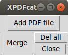
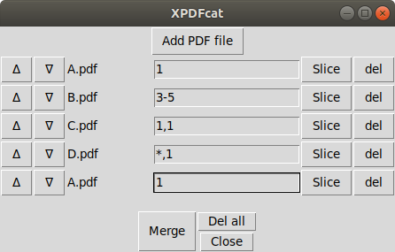
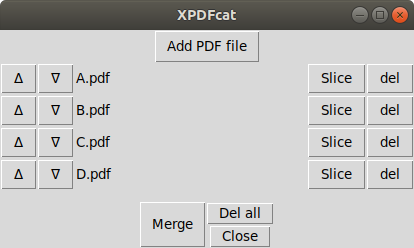
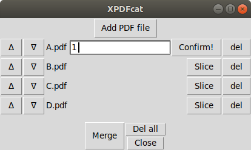

# Xpdfcat
GUI PDF slice and merge tool

In GUI window You select PDF files and decide their sequence and pages to be included in the output merged PDF file.

# Content
1. Installation
2. Usage

# Installation

## prerequesites

    Components required in the enviroment:
    * python3
    with following modules:
      * tkinter
      * PyPDF2

_(tested on Ubuntu, Mac, Windows 10_

_python2 not supported)_

## Install

##### using git

```
$ git clone https://github.com/ka-r-ol/Xpdfcat
```
Xpdfcat.pyw script is the only file needed and may be copied to any place of the user convenience.

##### or manually

Download Xpdfcat.pyw script  and store it to local disk.

# Usage

To start the program run:
```
$ python3 Xpdfcat.pyw
```
Following window will appear:


Example: Merge and slice
The task is following 4PDF files:  A.pdf, B.pdf, C.pdf and D.pdf  (can be found
  in 

Output file page number| is | cmposed of
-----------------------|----|-----
1st page| = | 1st page of the A.pdf
pages 2,3 and 4| = | pages 3, 4 and 5 of the B.pdf
5 page| = | 1st page of the C.pdf
6 page| = | again 1st page of the C.pdf
Pages from 7 to 55 of pages in D.pdf| = | all 48 pages of the D.pdf
The page before the last one| = | 1st page of the D.pdf
The last page| = 1st page of the A.pdf

The aim is to achieve following setup in the application:



* First store the samples on local disk.
* Then press „Add PDF file” button and select A.pdf file on the disk.

* Then repeat the action for the other files: B.pdf, C. pdf and D.pdf



* Then press


(if slice button is not selected by default all pages are included)


*Step 5: and finally press ‘Merge’ button and select the location of the
