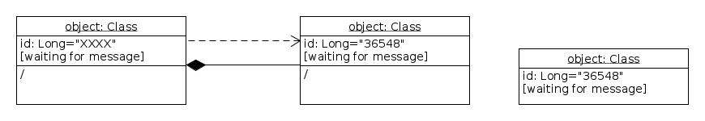

# Xpdfcat
GUI tool to merge and slice PDF files

# Content
1. Installation
2. Usage
3. Architecture

# Installation

## prerequesites

    Components required in the enviroment:
    * python3
    with following modules:
      * tkinter
      * PyPDF2
    (python2 not supported)

## Install

#### using git

```
$ git clone https://github.com/ka-r-ol/Xpdfcat
```
#### manually

Download Xpdfcat.pyw scirpt  and store it to local disk.

# Usage

To start the program run:
```
$ python3 Xpdfcat.pyw
```
Following window shold appear


Look into the real usage case 

# Architecture (for python developers)


